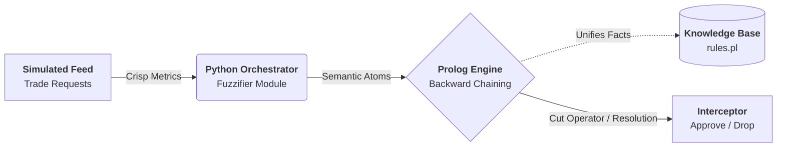

<div align="center">
  
  
  
  
  
</div>

# AegisRisk: Algorithmic Pre-Trade Compliance Engine

**AegisRisk** is an advanced, high-performance pre-trade risk and compliance engine. It explores the fusion of modern Python data orchestration seamlessly integrated with a classic **SWI-Prolog Expert System**. 

Unlike conventional trading engines that rely on brittle, nested `if-else` barriers, AegisRisk leverages a **Hybrid Knowledge Representation architecture**. It uses fuzzy logic to abstract continuous market streams (like spread and volatility) into semantic atoms, validating them against 25+ declarative Prolog risk policies prior to exchange routing.

---

## ⚡ Key Features

*   **Logic-Based Inference:** Over 80 distinct ontological facts and 25 dynamic IF-THEN policies separated from the codebase logic using standard backward chaining.
*   **Continuous-to-Discrete Fuzzifier:** Synthetically scores metrics (`volatility`, `spread`, `exposure`) into discrete semantic states (e.g., `wide`, `extreme`) to prevent context-blind rejections.
*   **Fail-Fast Circuit Breakers:** Executes real-time validation cuts (`!`) inside Prolog, isolating fat-finger errors before incurring cross-margin computational overhead.
*   **Institutional Streamlit Terminal:** Contains a Direct Market Access (DMA) testing terminal UI and an automated stochastic simulator to benchmark throughput. 
*   **Deterministic Audit Ledger:** Cryptographically structured, immutable JSONL logging of every inference traversal.

---

## 🏗️ System Architecture

The project fundamentally divides into four primary layers:



1. **Python Domain Models (`core/models.py`)**: Immutable dataclasses strictly defining `TradeTicket` payload structures and `MarketState` environments.
2. **The Fuzzifier (`engine/fuzzifier.py`)**: The data-preparation bridge dynamically mapping floating-point volatility and liquidity constraints into categorical Prolog facts.
3. **Prolog Interop FFI (`engine/bridge.py`)**: The runtime wrapper manipulating the `PySwip` architecture, asserting and retracting working memory dynamically per execution.
4. **Knowledge Base (`knowledge_base/rules.pl`)**: The isolated, declarative regulatory framework maintaining tiered compliance caps. 

---

## 🛠️ Prerequisites

Because AegisRisk operates a hybrid runtime utilizing the Foreign Function Interface (FFI) via `PySwip`, **SWI-Prolog** is a mandatory system dependency.

1. Install [SWI-Prolog](https://www.swi-prolog.org/download/stable) on your host machine.
2. Ensure the binary (e.g., `swipl`) is explicitly available in your environment `PATH`.

---

## 🚀 Quickstart Installation

1. **Clone the repository:**
   ```bash
   git clone https://github.com/yourusername/aegisrisk.git
   cd aegisrisk
   ```

2. **Create a secure virtual environment:**
   ```bash
   python -m venv venv
   source venv/bin/activate  # Windows: venv\Scriptsctivate
   ```

3. **Install exact dependencies:**
   ```bash
   pip install -r requirements.txt
   ```

---

## 💻 Running the Application

### 1. Interactive Compliance Dashboard (Streamlit UI)
AegisRisk comes with a fully stylized frontend containing both a **Live Surveillance** mode (running rapid algorithmic stochastics) and a **Manual Order Terminal** for injecting specific edge-cases.

```bash
streamlit run app.py
```

### 2. High-Velocity CLI Execution
To run bare-metal execution benchmarks bypassing the UI rendering engine:

```bash
# Run infinitely with a default 1-second interval
python main.py

# Run exactly 10 stress iterations with a 0.5 sec sleep latency
python main.py --iterations 10 --interval 0.5
```

---

## 🧪 Testing and CI/CD

An extensive regression test suite uses `pytest` to verify Prolog environment bindings, semantic accuracy within the fuzzifier, and memory-leak prevention inside the FFI.

```bash
# Execute unit testing suite
python -m pytest tests/
```

Code quality formatting and strict typing bounds are rigidly enforced via `ruff` and `mypy` before any PR merges:

```bash
ruff check .
ruff format .
mypy .
```

---

## 📄 License & Attribution

This project is licensed and protected under the **MIT License**. See the `LICENSE` file for full terms and agreements. 
Engineered for academic exploration in the domains of *Knowledge-Based Systems* and *Artificial Intelligence*.
