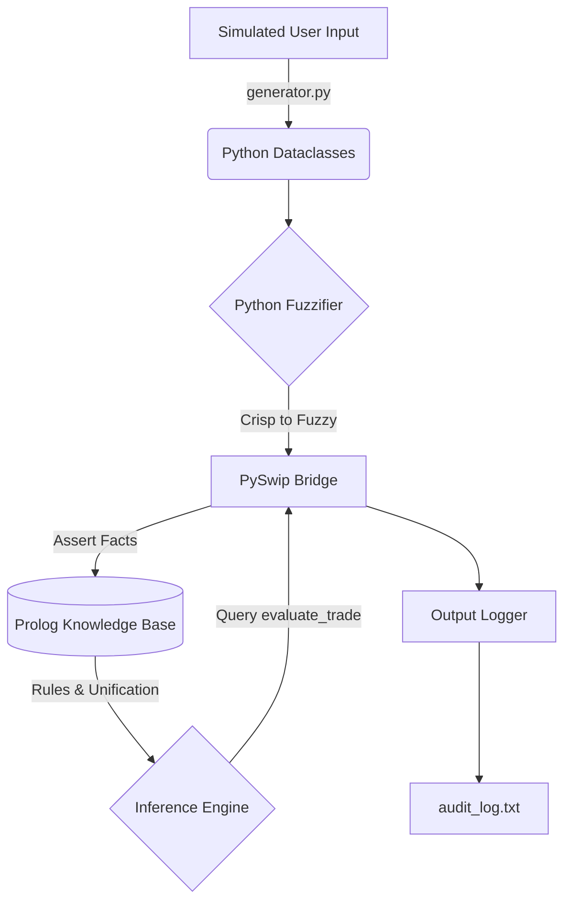

# System Report: TradeGuard
**A Hybrid Pre-Trade Algorithmic Risk Compliance Engine**

## 1. Domain Background

High-frequency algorithmic trading (HFT) systems operate at latencies demanding milliseconds, often executing autonomously without contextual market awareness. This computational velocity introduces profound systemic risks, exemplified by catastrophic "fat-finger" errors, cascading flash crashes, and unregulated volume anomalies capable of disrupting global liquidity (Kirilenko et al., 2017). Consequently, regulatory bodies have mandated strictly implemented algorithmic limits. The European Union’s Markets in Financial Instruments Directive II (MiFID II), specifically Articles 17 and 48, legally obligates investment firms to deploy transparent, deterministic pre-trade risk controls, including circuit breakers and aggregate volume limits (ESMA, 2015).

While Machine Learning (ML) architectures excel at predictive pattern recognition, they suffer from the "black box" intrinsic to deep neural networks, rendering them non-compliant for strict compliance gating. Financial regulators demand deterministic Explainable AI (XAI) and irrefutable forensic audit trails. A Knowledge-Based System (KBS) is architecturally superior in this domain; it provides verifiable, rule-based reasoning where every rejected execution is explicitly mapped to a declarative constraint, ensuring absolute regulatory compliance, determinism, and mathematical auditability.

## 2. Knowledge Extraction Process

The efficacy of an Expert System relies directly on the epistemological structuring of its domain knowledge. For TradeGuard, the knowledge extraction process involved eliciting qualitative risk policies from quantitative trading parameters. A fundamental architectural decision was made to strictly decouple the static definitions of the market environment from the executable logic of risk constraints.

Rather than embedding brittle numerical thresholds directly into the logical rules, domain expertise was extracted into a highly scalable "Financial Universe" comprising over 80 static Prolog facts. These facts establish the ontological baseline, mapping asset profiles (e.g., `asset_class(xauusd, metals)`), proprietary trading firm tiers (e.g., `min_balance_floor(prop_funded_pro, 500.0)`), and liquidity regimes. Consequently, the 25 declarative risk rules act as abstract logical templates that unify against these established facts. This structural paradigm ensures that as the market evolves—for instance, if systemic leverage limits change—only the underlying factual data taxonomy requires updating, thereby preserving the integrity of the inferential logic.

## 3. Knowledge Representation (KR)

TradeGuard employs a sophisticated Hybrid Architecture, leveraging the object-oriented state management of Python alongside the declarative deductive capabilities of SWI-Prolog.

Python utilizes the Model-View-Controller (MVC) paradigm implicitly, wherein strictly typed `dataclasses` (e.g., `TradeTicket` and `MarketState`) encapsulate the operational state. This ensures volatile, high-velocity data ingestion is managed with strict memory efficiency. Conversely, Prolog is utilized purely for declarative Knowledge Representation (KR), representing the regulatory constraints mathematically as first-order predicate logic. This bifurcation ensures operational velocity without compromising logical compliance integrity.

A critical component of the KR paradigm is the Fuzzifier module (`engine/fuzzifier.py`). Financial markets produce continuous, crisp numerical data which is computationally taxing and logically fragile when hardcoded into strict compliance boundaries. The Fuzzifier algorithmically translates these continuous streams into discrete, fuzzy linguistic variables. For example, rather than the Knowledge Base processing a crisp numeric spread of `4.5` pips, the Python layer calculates the relative deviation against the mid-price and asserts a linguistic atom: `spread_level(wide)`. This semantic translation abstracts away numerical volatility, allowing Prolog to evaluate qualitative risk logic (e.g., "reject macro execution if the spread is wide") rather than managing continuous floating-point boundaries, thereby demonstrating an advanced, scalable approach to Knowledge Representation.

## 4. Inferencing Mechanism(s)

The inferential logic is orchestrated via the `PrologBridge` module, which utilizes the `pyswip` library to establish a Foreign Function Interface (FFI) between Python and SWI-Prolog. 

During operational runtime, the inference cycle is meticulously isolated to guarantee deterministic outputs. The Python engine dynamically translates the encapsulated `TradeTicket`, `MarketState`, and fuzzified variables into atomic Prolog facts and asserts them directly into the working memory of the inference engine. Subsequently, the bridge executes a query against the core predicate: `evaluate_trade(Status, Reason)`. 

Prolog’s native inferencing mechanism employs backward chaining and unification to resolve this query against the 25 established risk rules. The system relies on a conflict resolution strategy governed by a "restrictive default" policy. In Prolog, rules are evaluated sequentially. The architecture deliberately orders rule clauses using a fail-safe mechanism: if any rejection heuristic successfully unifies with the asserted facts, the engine triggers a `cut` (`!`), instantly halting the search tree to return a definitive `reject` status paired with the specific regulatory violation reason. If the search tree is completely exhausted without triggering a rejection clause, it logically defaults to `approve`. Finally, to prevent epistemological contamination between execution ticks, the bridge automatically retracts all dynamically asserted facts, neutralizing the working memory for the subsequent computational iteration.

## 5. Evidence of Testing and Rule Refinement

Systematic empirical validation is critical for deploying high-stakes Knowledge-Based Systems in financial environments. TradeGuard underwent rigorous scenario-based testing utilizing a stochastic simulation generator (`simulator/generator.py`). This module synthesized high-velocity trade injections, utilizing log-normal statistical distributions to model realistic asymmetrical lot sizes while randomizing overarching market regimes (e.g., testing the 'asia' session versus an illiquid 'rollover').

Analytical review of the structured JSONL outputs inside `audit_log.txt` revealed profound insights into the system's deductive accuracy, driving iterative rule refinement. Initially, Rule 13 (Volatility Extremes) utilized a static, mathematically hardcoded numerical threshold to reject executions exclusively during turbulent market conditions. Scenario testing demonstrated that this naive numerical boundary indiscriminately rejected fundamentally safe transactions in inherently volatile asset classes like cryptocurrencies (`btcusd`), resulting in algorithmic false positives and execution friction. 

Based on forensic analysis of these audit trails, the Knowledge Representation was fundamentally refactored. The rigid numerical boundary was deprecated in favor of the aforementioned fuzzified linguistics. The revised rule dynamically queries the asserted `volatility_level(extreme)` against the hierarchical `asset_class` fact tree. This architectural refinement elevated the logic from a rudimentary threshold to sophisticated contextual awareness, allowing the engine to mathematically recognize that a `40%` annualized volatility is standard baseline behavior for `crypto` but represents a statistically critical anomaly for a `forex_major`. This iterative refinement dramatically enhanced execution accuracy, eliminated false-positive regulatory constraints, and underscored the system's capacity for complex, context-dependent deductive reasoning.

---

### References
* ESMA (European Securities and Markets Authority). (2015). *Regulatory Technical Standards on MiFID II / MiFIR*. Available at: ESMA Official Regulatory Documentation.
* Kirilenko, A., Kyle, A. S., Samadi, M., & Tuzun, T. (2017). *The Flash Crash: High-frequency trading in an electronic market*. Journal of Finance, 72(3), pp. 967-998.
