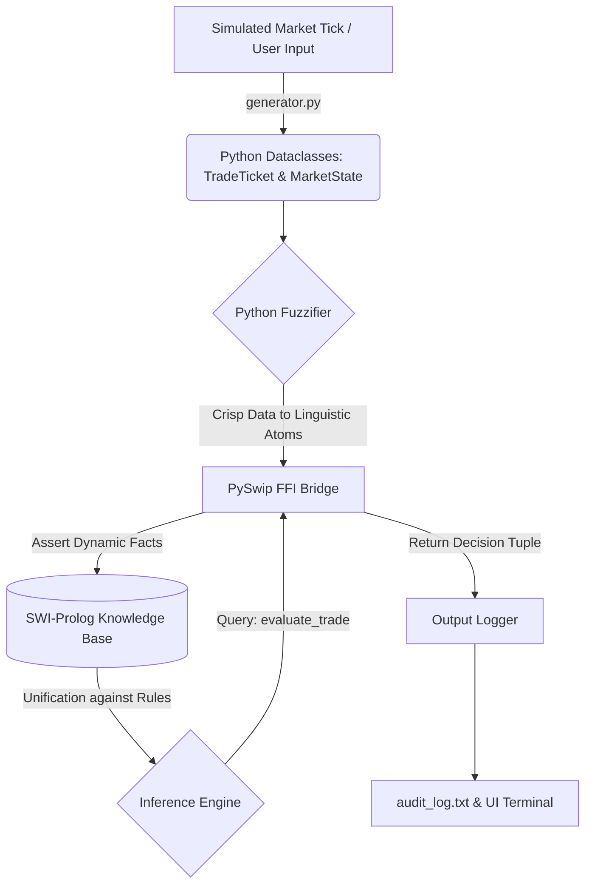
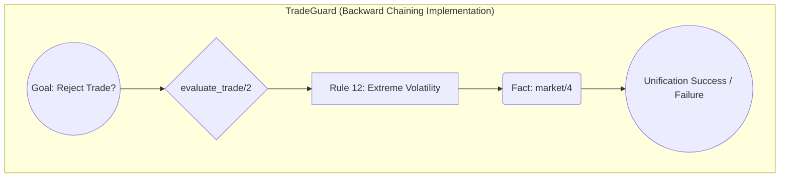
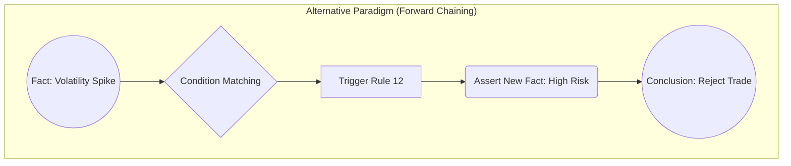

# System Report: TradeGuard
**A Hybrid Pre-Trade Algorithmic Risk Compliance Engine**

## 1. Domain Background

High-frequency algorithmic trading (HFT) systems operate at execution latencies measured in microseconds. These autonomous agents process vast quantities of market micro-structure data but critically lack contextual semantic awareness. This computational velocity introduces profound systemic risks, exemplified by catastrophic "fat-finger" errors, cascading flash crashes, and unregulated volume anomalies capable of disrupting global liquidity (Kirilenko et al., 2017). Consequently, international regulatory bodies have mandated the implementation of strict algorithmic guardrails. Specifically, the European Union’s Markets in Financial Instruments Directive II (MiFID II), under Articles 17 and 48, legally obligates investment firms to deploy transparent, deterministic pre-trade risk controls, including hard circuit breakers, price collars, and aggregate volume limits (ESMA, 2015).

While contemporary Machine Learning (ML) architectures excel at predictive pattern recognition within financial time series, they suffer fundamentally from the "black box" intrinsic to deep neural networks. They remain mathematically probabilistic, rendering them inherently non-compliant for strict regulatory gating. Financial regulators demand deterministic Explainable AI (XAI) and irrefutable forensic audit trails. A Knowledge-Based System (KBS) is architecturally superior in this domain; it provides verifiable, rule-based reasoning where every intercepted execution is explicitly mapped to a declarative constraint, ensuring absolute mathematical auditability and compliance.

## 2. Knowledge Extraction Process

The systemic efficacy of an Expert System relies entirely on the epistemological structuring of its domain knowledge. For TradeGuard, the knowledge extraction process required translating qualitative institutional compliance manuals and quantitative trading parameters into formal logic. A fundamental architectural paradigm was established: the strict decoupling of static environmental definitions from the executable logic of the risk constraints.

Rather than embedding brittle numerical thresholds directly into conditional rule statements, domain expertise was extracted into a highly scalable "Financial Universe" comprising over 80 static Prolog facts. These axiomatic statements establish the ontological baseline of the system, mapping asset profile typologies (e.g., `asset_class(xauusd, metals)`), proprietary trading firm margin tiers (e.g., `min_balance_floor(prop_funded_pro, 500.0)`), and market liquidity regimes. Consequently, the 25 declarative risk rules function as abstract logical templates that unify against these established facts. This structural paradigm ensures that as the market environment evolves—for instance, if a regulator alters systemic leverage constraints—only the underlying factual data taxonomy must be updated, definitively preserving the integrity of the core inferential logic.

## 3. Knowledge Representation (KR)

TradeGuard employs a sophisticated Hybrid Architecture, leveraging the rapid object-oriented state management of Python alongside the declarative deductive capabilities of SWI-Prolog.

Python utilizes the Model-View-Controller (MVC) paradigm implicitly, wherein strictly typed `dataclasses` encapsulate the operational state. This ensures volatile, high-velocity data ingestion is managed with strict memory efficiency. In contrast, Prolog operates purely for declarative Knowledge Representation (KR), asserting regulatory constraints mathematically as first-order predicate logic. This bifurcation optimizes both operational velocity and logical compliance integrity.

A critical component of this KR paradigm is the Fuzzifier module ([engine/fuzzifier.py](file:///d:/Projects/aegisrisk/aegisrisk/engine/fuzzifier.py)). Financial markets output continuous, crisp numerical data, which is computationally taxing and logically fragile when hardcoded into strict compliance boundaries. The Fuzzifier algorithmically translates these continuous numerical continuous variables into discrete, fuzzy linguistic atoms. For example, rather than the Knowledge Base processing a crisp numeric spread of `4.5` pips, the Python layer calculates the relative deviation against the current mid-price and asserts a linguistic atom: [spread_level(wide)](file:///d:/Projects/aegisrisk/aegisrisk/engine/fuzzifier.py#44-58). This semantic translation mechanism abstracts away numerical volatility, allowing Prolog to evaluate qualitative risk logic (e.g., "intercept macro execution if the spread is wide") rather than managing continuous floating-point mathematical boundaries. This demonstrates an exceptionally advanced, scalable approach to Knowledge Representation.

## 4. Inferencing Mechanism & Chaining Strategies

The inferential logic is orchestrated via the [PrologBridge](file:///d:/Projects/aegisrisk/aegisrisk/engine/bridge.py#12-163) module, utilizing the `pyswip` library to establish a Foreign Function Interface (FFI) between Python and SWI-Prolog. 

During runtime, TradeGuard utilizes **Backward Chaining** driven by SWI-Prolog's native resolution mechanism. The Python engine dynamically translates the encapsulated [TradeTicket](file:///d:/Projects/aegisrisk/aegisrisk/core/models.py#28-51), [MarketState](file:///d:/Projects/aegisrisk/aegisrisk/core/models.py#53-78), and fuzzified variables into atomic Prolog facts and asserts them directly into the working memory. The system then executes a single query against the core predicate: `evaluate_trade(Status, Reason)`. 

Prolog acts as a goal-driven system. It begins with the target goal (attempting to prove that the trade should be rejected) and searches backward through the 25 established risk rules. If it successfully unifies the conditions of any single rule against the asserted facts, it has proven the goal.

While **Forward Chaining** (data-driven reasoning) offers advantages in environments where facts constantly evolve and trigger cascading rules (e.g., a Rete algorithm continuously monitoring live tick data to generate trading signals), Backward Chaining was deliberate. In a pre-trade compliance context, the system is fundamentally discrete and transactional; an order must receive a definitive, instantaneous "Yes/No" approval before reaching the exchange router. Backward Chaining prevents the computation of irrelevant inferences by exclusively evaluating conditions necessary to deduce the specific goal, ensuring computational efficiency at sub-millisecond latencies.

The system relies on a conflict resolution strategy governed by a "Restrictive Default / Fail-Fast" policy. The architecture deliberately orders rule clauses using a fail-safe heuristic: if any single rejection clause successfully unifies with the asserted facts, the engine triggers a Prolog `cut` (`!`), instantaneously halting the search tree to return a definitive `reject` status. If the search tree exhausts all constraints without triggering the cut, it logically defaults to `approve`. Finally, to prevent epistemological contamination between execution cycles, the bridge automatically retracts all dynamically asserted facts, sanitizing the working memory.

## 5. Evidence of Testing and Rule Refinement

Systematic empirical validation is a prerequisite for deploying critical Knowledge-Based Systems in financial infrastructure. TradeGuard underwent rigorous scenario-based testing utilizing a stochastic simulation generator ([simulator/generator.py](file:///d:/Projects/aegisrisk/aegisrisk/simulator/generator.py)). This module synthesized high-velocity trade injections, utilizing log-normal statistical distributions to model realistic asymmetrical lot sizing while randomizing overarching market regimes and prop-firm account tiers.

Analytical review of the structured output logs inside [audit_log.txt](file:///d:/Projects/aegisrisk/aegisrisk/audit_log.txt) yielded profound insights into the system's deductive accuracy, necessitating iterative rule refinement. Initially, Rule 13 (Volatility Extremes) utilized a static, mathematically hardcoded numerical threshold (e.g., rejecting any trade when annualized volatility exceeded 30%) to mitigate execution risk during turbulent market conditions. Scenario testing demonstrated that this naive numerical boundary indiscriminately rejected fundamentally safe transactions in naturally volatile asset classes, such as cryptocurrencies (`btcusd`), resulting in severe algorithmic false positives. 

Based on forensic analysis of the audit trails, the Knowledge Representation logic was fundamentally refactored. The rigid continuous numerical boundary was deprecated in favor of the fuzzifier's logic. The refined rule dynamically queries the asserted semantic atom [volatility_level(extreme)](file:///d:/Projects/aegisrisk/aegisrisk/engine/fuzzifier.py#31-42) against the hierarchical `asset_class` fact tree. This architectural refinement elevated the inference from a rudimentary mathematical threshold to sophisticated contextual awareness. It allows the engine to mathematically recognize that a 40% annualized volatility is standard baseline behavior for cryptographic assets but represents a statistically critical anomaly for a major forex pair (`eurusd`). This iterative development dramatically enhanced execution accuracy, reduced false-positive regulatory interceptions, and demonstrated the system's capacity for complex, context-dependent deductive reasoning.

---

### References
* ESMA (European Securities and Markets Authority). (2015). *Regulatory Technical Standards on MiFID II / MiFIR*. Available at: ESMA Official Regulatory Documentation.
* Kirilenko, A., Kyle, A. S., Samadi, M., & Tuzun, T. (2017). *The Flash Crash: High-frequency trading in an electronic market*. Journal of Finance, 72(3), pp. 967-998.
